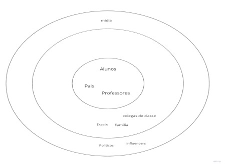

# Introdução
O projeto visa compreender o problema relacionado ao aprendizado dos alunos nas escolas, tendo como prioridade crianças e adolescentes, estudantes dos ensinos fundamental e médio. Com o problema definido, o projeto terá como meta tratar a solução para este problema interagindo diretamente com o usuário e aprimorando a solução à medida em que avança a compreensão.

## Problema
Com base em entrevista qualitativa, é um fato que a maior parte dos estudantes de ensinos fundamental e médio enfrentam dificuldades em absorver o conhecimento de determinadas disciplinas as quais são oferecidas nas escolas. As disciplinas e os relatos dos “por quês” das dificuldades variam, o que dificulta encontrar um padrão para ser seguido na busca exata do problema.
Os pais ou responsáveis das crianças e adolescentes entendem a dificuldade de seus filhos em determinadas matérias, mas devido ao pouco tempo disponível, não conseguem auxiliar de forma prática seus filhos.
Professores entendem que a aplicação de metodologia tem uma barreira de dificuldade, pois crianças e adolescentes são singulares e uma metodologia que é funcional para um aluno pode não ser para outro. Sendo este um ponto de dificuldade na interação com os alunos de maneira abrangente.

## Objetivo

O projeto tem como objetivo entregar àqueles alunos com dificuldades em absorver determinadas disciplinas uma maneira diferente de aprender, tornando-se uma ferramenta auxiliar para os professores e pais na resolução do problema das crianças e adolescentes.

O projeto visa:
- Proporcionar várias maneiras de se ensinar determinadas disciplinas escolares, variando metodologias e abrangem qualquer tipo de público-alvo;
- Tratar o problema de cada aluno de maneira singular;
- Servir como ferramenta de aprendizagem, respeitando os direitos humanos e as normas regulamentares cabíveis.

## Justificativa

Todos os envolvidos no projeto se comprometem a atender o objetivo proposto, contribuindo com seus papeis para o desenvolvimento de uma aplicação que seja funcional e intuitiva.

## Público-Alvo

O público alvo do projeto pode ser identificado com base no Canvas abaixo:

Pode-se observar que os principais envolvidos serão alunos, pais/responsáveis e professores, tendo este grupo como o principal público alvo do projeto.
Em uma segunda esfera de grau de importância, encontram-se colegas de classe, a escola e a família de uma maneira mais abrangente, como tios, primos, avós, etc.
Seguindo o grau de importância do público alvo, encontram-se políticos, que terão papel importante em normatizar e legalizar o uso da aplicação, mídia e influencers na divulgação e popularização da aplicação.

