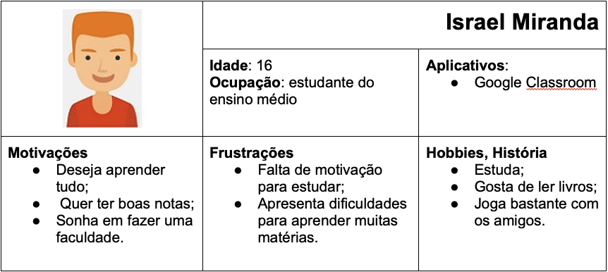
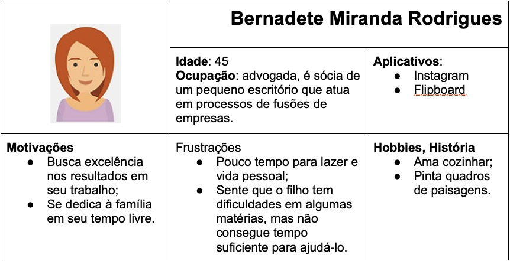
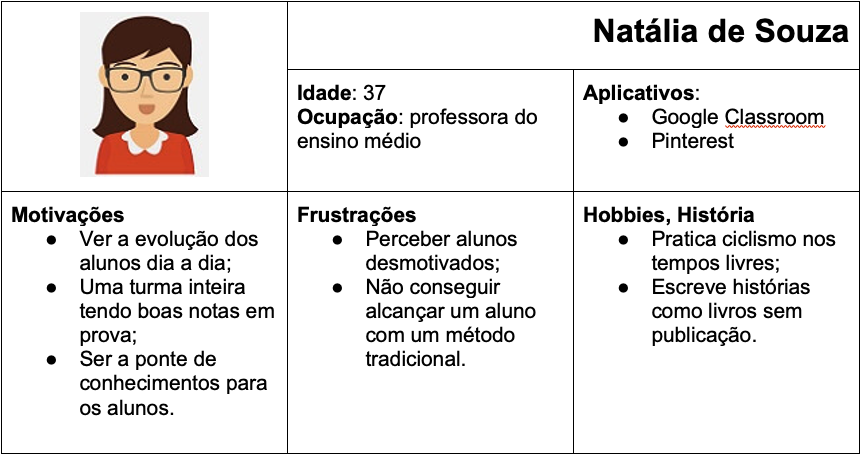

# Especificações Do Projeto

A maior parte dos estudantes de ensino fundamental e médio enfrentam dificuldades em absorver o conhecimento de determinadas disciplinas as quais são oferecidas nas escolas. Esses dados foram concluídos através da entrevista realizada com alguns estudantes para o projeto. Diante disso, os pontos mais relevantes a serem realizados no projeto estão expostos em formas de personas e histórias de usuários.

## Personas

As personas levantadas durante o processo de entendimento do problema são apresentadas nos cards a seguir:

## Histórias de Usuários

A partir da compreensão do dia a dia das personas identificadas para o projeto, foram registradas as seguintes histórias de usuários:

| **Eu como...** | **...quero/desejo...** | **...para...** |
| --- | --- | --- |
| Israel Miranda | ter acesso a conteúdos mais dinâmicos | aprender melhor as matérias |
| Israel Miranda | poder compartilhar dúvidas sobre as matérias | conseguir, de maneira prática, solucionar as dúvidas nas matérias |
| Bernadete Miranda | visualizar os feedbacks das aulas e exercícios do filho | ter noção das dúvidas e certezas que seu filho apresenta |
| Natália de Souza | compartilhar os materiais para os alunos | permitir que os alunos visualizem as matérias por um meio mais atrativo |
| Natália de Souza | postar e acessar os materiais tanto pelo desktop quanto pelo celular | facilitar nas visualizações e postagens dos materiais |

## Requisitos

Os requisitos funcionais e não funcionas levantados diante as necessidades dos clientes para a construção do projeto foram:

### Requisitos Funcionais

A tabela mostra as descrições dos requisitos com sua prioridade:

|ID     | Descrição do Requisito  |Prioridade |
|-------|-------------------------|----|
| RF-001 | O site deve apresentar na página principal o conteúdo mais relevante para o usuário. | Alta |
| RF-002 | O site deve apresentar, para cada conteúdo, uma imagem correspondente ao assunto apresentado. | Média |
| RF-003 | O site deve permitir ao usuário o acesso ao conteúdo digital relacionado à matéria para estudo. | Alta |
| RF-004 | O site deve oferecer uma funcionalidade de filtro/pesquisa para permitir ao usuário localizar um assunto específico que será informado na caixa de pesquisa. | Alta |
| RF-005 | O site deve permitir visualizar as informações de contatos do mantenedor do site. | Média |
| RF-006 | O site deve permitir visualizar as informações de contatos do mantenedor do site. | Média |
| RF-007 | O site deve permitir o upload de material por parte dos professores para as matérias. | Alta |
| RF-008 | O site deve permitir salvar os conteúdos escolhidos. | Baixa |
| RF-009 | O site deve permitir que os usuários possam comentar sobre o que acharam do conteúdo já assistido. | Baixa |

### Requisitos não Funcionais

|ID     | Descrição do Requisito  |Prioridade |
|-------|-------------------------|----|
|RNF-001| O sistema deve ser responsivo para rodar em um dispositivos móvel | MÉDIA | 
|RNF-002| Deve processar requisições do usuário em no máximo 3s |  BAIXA | 

> Com base nas Histórias de Usuário, enumere os requisitos da sua
> solução. Classifique esses requisitos em dois grupos:
>
> - [Requisitos Funcionais
>   (RF)](https://pt.wikipedia.org/wiki/Requisito_funcional):
>   correspondem a uma funcionalidade que deve estar presente na
>   plataforma (ex: cadastro de usuário).
>
> - [Requisitos Não Funcionais
>   (RNF)](https://pt.wikipedia.org/wiki/Requisito_n%C3%A3o_funcional):
>   correspondem a uma característica técnica, seja de usabilidade,
>   desempenho, confiabilidade, segurança ou outro (ex: suporte a
>   dispositivos iOS e Android).
>
> Lembre-se que cada requisito deve corresponder à uma e somente uma
> característica alvo da sua solução. Além disso, certifique-se de que
> todos os aspectos capturados nas Histórias de Usuário foram cobertos.

## Restrições

O projeto está restrito pelos itens apresentados na tabela a seguir.

|ID| Restrição                                             |
|--|-------------------------------------------------------|
|01| O projeto deverá ser entregue até o final do semestre |
|02| Não pode ser desenvolvido um módulo de backend        |

> Enumere as restrições à sua solução. Lembre-se de que as restrições
> geralmente limitam a solução candidata.
> 
> **Links Úteis**:
> - [O que são Requisitos Funcionais e Requisitos Não Funcionais?](https://codificar.com.br/requisitos-funcionais-nao-funcionais/)
> - [O que são requisitos funcionais e requisitos não funcionais?](https://analisederequisitos.com.br/requisitos-funcionais-e-requisitos-nao-funcionais-o-que-sao/)
