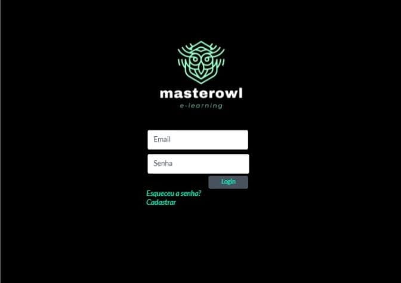

# Projeto de Interface
De acordo com a necessidade que as personas apresentaram, presamos por um design de interface que fosse de fácil acesso para todos os usuários.
Fluxo do Usuário
 
## Fluxo de telas do usuário
Wireframes
Conforme fluxo de telas do projeto, apresentado no item anterior, as telas do sistema são apresentadas em detalhes nos itens que se seguem. Nesta estrutura, existem 2 grandes blocos, descritos a seguir. São eles:
*	Cabeçalho - local onde estão localizados a logo e outros elementos de navegação;
*	Conteúdo - apresenta o conteúdo da tela selecionada.
 
## Tela de login
A tela de login apresenta os campos necessários para acessar a página. Nela é colocado email que foi cadastrado no site.

## Tela de recuperação de senha
Caso o usuário esqueça a senha cadastrada no site, ele deverá clicar no comando “Esqueceu a senha?” e será transferido para a página de recuperação de senha.

 
Tela de recuperação de senha
 
Tela de cadastro
Caso o usuário não seja cadastrado no site, ele será encaminhado para a tela de cadastro, onde mostrará o que é necessário para se cadastrar no site.

 
Tela de cadastro

Tela principal
A tela principal mostra todo o conteúdo do site e onde o usuário pode navegar, como o menu de matérias, contatos, novidades, notas e perfil.

 
Tela principal
Tela - Menu de Matérias
Após o usuário clicar em alguma matéria apresentada no Menu de Matérias, ele será encaminhado para uma página que apresenta todo o conteúdo, como vídeo aula e atividades, postado sobre esse assunto e poderá fazer comentários sobre algum material não encontrado ou suas dúvidas.

 
Tela – Menu de Matérias

Tela - Contatos
A tela de contatos apresenta todas as formas possíveis para o usuário entrar em contato com os desenvolvedores do site. 

 
Tela - Contatos

Tela - Resultado de Pesquisa
Caso o usuário pesquise alguma informação na barra de pesquisa, apresentado na tela principal, ele será encaminhado para a tela de resultado de pesquisa.

 
Tela - Resultado de Pesquisa
Tela - Novidades
Caso o usuário pesquise alguma informação na barra de pesquisa, apresentado na tela principal, ele será encaminhado para a tela de resultado de pesquisa.

 
Tela - Novidades
 
Tela - Notas
A tela notas permite o usuário ver seu desempenho em suas atividades realizadas e visualizar algum comentário feito por professores.

 
Tela - Notas
Tela - Perfil
A tela de perfil permite que o usuário visualize suas informações pessoais e seus materiais salvos. 

 .
Tela - Perfil
 
Tela - Materiais Salvos 
A tela de Materiais Salvos apresenta todos os materiais que o usuário salvou para futuras visualizações.

 
Tela - Materiais 
