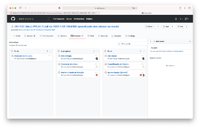

# Gerenciamento de Projeto

## Metodologia
A metodologia contempla as definições de ferramental utilizado pela equipe tanto para a manutenção dos códigos e demais artefatos quanto para a organização do time na execução das tarefas do projeto.

## Divisão de Papéis

A equipe está organizada da seguinte maneira:
* Scrum Master: Frederico Martins Rodrigues
* Product Owner: Rommel Carneiro
* Equipe de Desenvolvimento
    - Ana Flávia de Souza Ribeiro
    - Frederico Martins Rodrigues
    - Nando Augusto Veloso Tupinambá
* Equipe de Design
    - Ana Flávia de Souza Ribeiro

Para organização e distribuição das tarefas do projeto, a equipe está utilizando um modelo de Kanban dentro da plataforma GitHub estruturado com as seguintes listas: 

- To Do: Esta lista representa o Sprint Backlog. Este é o Sprint atual que estamos trabalhando.
- Doing: Quando uma tarefa tiver sido iniciada, ela é movida para cá.
- Done: nesta lista são colocadas as tarefas que passaram pelos testes e controle de qualidade e estão prontos para ser entregues ao usuário. Não há mais edições ou revisões necessárias, ele está agendado e pronto para a ação.

O quadro Kanban do grupo no GitHub está disponível através da URL https://github.com/ICEI-PUC-Minas-PPLES-TI/plf-es-2021-1-ti1-7924100-aprendizado-dos-alunos-na-escola/projects e é apresentado, no estado atual, na Figura abaixo:

## Processo

A metodologia contempla as definições de ferramental utilizado pela equipe tanto para a manutenção dos códigos e demais artefatos quanto para a organização do time na execução das tarefas do projeto.

### Ferramentas

Os artefatos do projeto são desenvolvidos a partir de diversas plataformas e a relação dos ambientes com seu respectivo propósito é apresentada na tabela que se segue. 

| **Ambiente** | **Plataforma** | **Link de Acesso** |
| --- | --- | --- |
| Repositório de Código Fonte | Repl.it / GitHub | https://replit.com / https://github.com/ICEI-PUC-Minas-PPLES-TI/plf-es-2021-1-ti1-7924100-aprendizado-dos-alunos-na-escola |
| Projeto de Interface e Wireframes | MarvelApp | https://marvelapp.com |
| Gerenciamento do Projeto | GitHub | https://github.com/ICEI-PUC-Minas-PPLES-TI/plf-es-2021-1-ti1-7924100-aprendizado-dos-alunos-na-escola/projects |
| Desenvolvimento do código | Visual Studio Code / Adobe Dreamweaver | [Aplicativos instalados nas máquinas dos desenvolvedores] |

