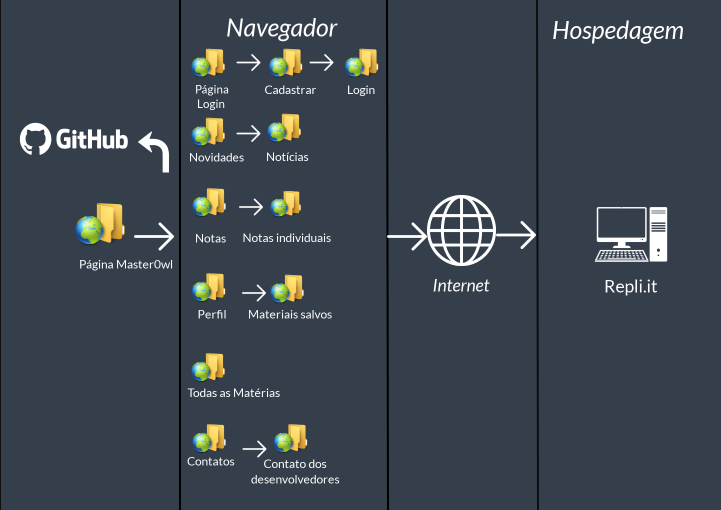

# Projeto da Solução

## Arquitetura da solução

### Diagrama de Componentes

Os componentes que fazem parte da solução são apresentados na Figura que se segue.

A solução implementada conta com os seguintes módulos:
* Navegador - Interface básica do sistema .
  - Pagina Master0wl - Guias do nosso projeto:
  - Login - Pagina onde o usuario vai se cadastrar ou fazer login para quem já possui uma conta.
  - Novidades - Pagina onde direciona para notícias/assuntos recentes.
  - Notas - Direciona para as notas individuais do aluno.
  - Perfil - No perfil ficará os materiais salvos, que o aluno fez e o salvou.
  - Matérias - Todas opções de matérias que temos estará na barra.
  - Contatos - Direciona o aluno ao contato dos desenvolvedores, para quaisquer dúvidas.

