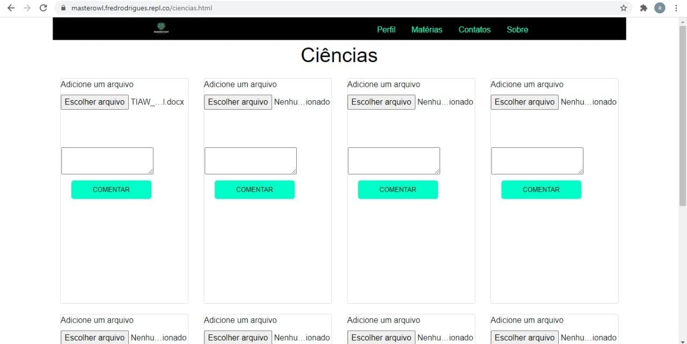

# Plano de Testes

## Requisitos Funcionais:

**Caso de Teste	CT-01-**  Fazer Login

**Requisitos Associados-**	RF-01 - O site deve permitir o login dos usuários

**Objetivo do Teste-**	Verificar se o usuário apresenta o cadastro no site e permitir que ele navegue pelo site.

**Passos-**

1) Acessar o Navegador;

2) Entrar no site “MasterOwl”;

3) Clicar em “Perfil” e realizar o login.

**Critérios de Êxito-**	•	O usuário já cadastrado deve conseguir realizar o login.

-----------------------------------------------------------------------

**Caso de Teste	CT-02-**  Fazer o cadastro

**Requisitos Associados-**	RF-02 - O site deve permitir o cadastro de usuários.

**Objetivo do Teste-**	Verificar se o usuário conseguiu fazer o cadastro

**Passos-**	
1) Acessar o Navegador;

2) Entrar no site “MasterOwl”;

3)Clicar em “Perfil” e realizar o cadastro.

**Critérios de Êxito-**	O site deve fornecer a página de cadastro para o usuário.
-----------------------------------------------------------------------

**Caso de Teste	CT-03-** Recuperar senha

**Requisitos Associados-**	RF-02 - O site deve permitir que o usuário recupere sua senha.

**Objetivo do Teste-**	Verificar se o usuário consegue recuperar sua senha

**Passos-**	

1) Acessar o Navegador;

2) Entrar no site “MasterOwl”;

3) Solicitar a recuperação de senha;

4) Verificar se o usuário recebeu sua senha.

**Critérios de Êxito-**	O site deve apresentar o comando de recuperar senha e fornecer a senha para o usuário que solicitou.

-----------------------------------------------------------------------

**Caso de Teste	CT-04 –** Visualizar na tela principal, a opção perfil

**Requisitos Associados-**	RF-04 - O site deve ter uma página para visualizar e editar seu perfil.

**Objetivo do Teste-**	Verificar se na tela inicial apresenta o comando “perfil” e se o usuário será guiado para a tela de perfil, onde poderá fazer algumas alterações.

**Passos-**

1) Acessar o Navegador;

2) Visualizar a página principal;

3) Verificar se apresenta o comando perfil;

4) Verificar se o usuário foi encaminhado para a tela de perfil;

5) Verificar se o usuário consegue fazer alterações.

**Critérios de Êxito-**		A tela principal deve apresentar o comando de perfil e deve guiar o usuário para uma página que irá apresentar seu perfil. 

-----------------------------------------------------------------------

**Caso de Teste	CT-05 –** Visualizar na tela principal, a opção de contatos
**Requisitos Associados**	RF-05 - O site deve permitir visualizar as informações de contatos do mantenedor do site.

**Objetivo do Teste-**	Verificar se na tela inicial apresenta a opção de “contatos” e se o usuário será guiado para a tela de contatos

**Passos-**	

1) Acessar o Navegador;

2) Visualizar a página principal;

3) Verificar se apresenta os contatos dos desenvolvedores.

**Critérios de Êxito-**		A tela principal deve apresentar todos os contatos dos desenvolvedores.

-----------------------------------------------------------------------

**Caso de Teste	CT-06 –** Fazer upload dos conteúdos

**Requisitos Associados**	RF-07 - O site deve permitir o upload de material por parte dos professores para as matérias.

**Objetivo do Teste-**	Verificar se na tela inicial, visualizada pelo professor apresenta a opção de “Escolher Arquivo” 

**Passos-**

1) Acessar o Navegador;

2) Entrar no site “MasterOwl”;

3) Clicar em alguma matéria disponível;

3) Verificar se apresenta o comando “Escolher Arquivo”.

**Critérios de Êxito-**		A tela de matéria deve apresentar o comando de carregar conteúdo.

-----------------------------------------------------------------------
**Caso de Teste	CT-07 –** Visualizar na tela principal as matérias para estudo 

**Requisitos Associados**	RF-06 - O site deve permitir ao usuário o acesso ao conteúdo digital relacionado à matéria para estudo.

**Objetivo do Teste-**	Verificar se na tela principal apresenta o menu de matérias e se é possível o usuário navegar em todas.

**Passos-**	

1) Acessar o Navegador;

2) Entrar no site “MasterOwl”;

3) Verificar se na tela principal apresenta o menu de matérias;

4) Verificar se o usuário conseguiu acesso as páginas.

**Critérios de Êxito-**•	A tela principal deve apresentar o menu de matérias.

-----------------------------------------------------------------------
**Caso de Teste	CT-08 –** Visualizar em cada tela o card de comentário

**Requisitos Associados-**	RF-08 -O site deve permitir que os usuários possam comentar sobre o que acharam do conteúdo já assistido

**Objetivo do Teste-**	Verificar se nas telas escolhidas pelo usuário apresenta o card de comentário e se ele tem permissão para fazer um ou mais comentários 

**Passos-**

1) Acessar o Navegador;

2) Entrar no site “MasterOwl”;

3)Clicar em alguma matéria disponível no menu de matérias;

4) Visualizar na tela o card de comentário;

5) Verificar se o usuário consegue fazer comentários.

**Critérios de Êxito-**		As telas devem apresentar o card de comentário e permitir que o usuário faça um ou mais usuários.

-----------------------------------------------------------------------

## Requisitos Não Funcionais

**Caso de Teste	CT-01 –** Visualizar o site no Repl.it

**Requisitos Associados-**	RNF-01 - O site deve ser publicado em um ambiente acessível publicamente na Internet (Repl.it).

**Objetivo do Teste-**	Verificar se o código está acessível no Repl.it

**Passos-**	
1) Acessar o Repl.it
2) Visualizar os códigos 
3) Verificar se o documento está público na internet

**Critérios de Êxito-**	•	O código deve está acessível no Repl.it 

-----------------------------------------------------------------------
**Caso de Teste	CT-02 –** Visualizar a responsividade do site

**Requisitos Associados-**	RNF-02 - O site deverá ser responsivo permitindo a visualização em um celular de forma adequada

**Objetivo do Teste-**	Verificar se o site é responsivo

**Passos-**	

1) Acessar o site no Repl.it em outros aparelhos eletrônicos

2) Verificar se o site segui o padrão responsivo

**Critérios de Êxito-**		O site deve ser responsivo

-----------------------------------------------------------------------
**Caso de Teste	CT-03 –** Visualizar o contraste entre os elementos da tela em conformidade

**Requisitos Associados-**	RNF-03 - O site deve ter bom nível de contraste entre os elementos da tela em conformidade

**Objetivo do Teste-**	Verificar se o site apresenta contraste entre os elementos da tela em conformidade

**Passos-**	

1) Acessar o site no Repl.it

2) Verificar se o site apresenta contraste entre os elementos da tela em conformidade

**Critérios de Êxito-**		O site deve apresentar um bom nível de contraste entre os elementos da tela em conformidade

-----------------------------------------------------------------------

**Caso de Teste	CT-04 –** Visualizar em cada tela o card de comentário

**Requisitos Associados-**	RNF-04 - O site deve ser compatível com os principais navegadores do mercado (Google Chrome, Firefox, Microsoft Edge)

**Objetivo do Teste-**	Verificar se o pode ser acessado nos principais browsers (Google Chrome, Firefox, Microsoft Edge)

**Passos-**	

1) Acessar o Repl.it em qualquer navegador.

**Critérios de Êxito-**	O site deve funcionar nos principais navegadores do mercado

-----------------------------------------------------------------------

# REGISTRO DE TESTE DE SOFTWARE
## Requisitos Funcionais:

   	 **CT-01 – Fazer login**
      -----------------------------------Figura 1--------------------------------------
      -----------------------------------Figura 2--------------------------------------
      -----------------------------------Figura 3--------------------------------------
**Relatório de teste - **Ao entrar no site “MasterOwl”, o usuário verificou no cabeçalho a opção perfil. Ao clicar nessa opção, o usuário foi encaminhado para a tela de login (figura 1). Como o usuário ainda não havia se cadastrado no site, ele recebeu um aviso de redirecionamento para a tela de cadastro (figura 2). Após realizar o cadastro, o usuário visualizou no LocalStorage seus dados e foi encaminhado novamente para a página de login, onde conseguiu acesso ao site (figura 3).

**Erros -** Não apresentou nenhum erro

-----------------------------------------------------------------------
**CT-02 – Fazer cadastro**
      -----------------------------------Figura 1--------------------------------------
      -----------------------------------Figura 2--------------------------------------
      -----------------------------------Figura 3--------------------------------------
**Relatório de teste - **Ao tentar o login no site ou clicar na opção “Cadastrar-se”, o usuário foi encaminhado para a tela de cadastro. Após o usuário preencher todos os campos obrigatórios, o localStorage salvou os dados (figura 2), retornou o usuário para a tela de login e permitiu o acesso ao site. (figura 3)

**Erros -**Não apresentou nenum erro
-----------------------------------------------------------------------
**CT-03 – Recuperar Senha**
      -----------------------------------Figura 1--------------------------------------
      -----------------------------------Figura 2--------------------------------------
**Relatório de teste - **Ao clicar na opção “Esqueceu a senha?”, o usuário foi encaminhado para a tela de Recuperar senha (figura 1), porém não foi enviado um email para recuperar a senha.

**Erros -** O usuário não recebeu um email para recuperar a senha. Para resolver esse problema, a equipe irá olhar novamente o código e instalar uma API do Google(Contas Google).
-----------------------------------------------------------------------
**CT-04 – Visualizar na tela principal, a opção perfil**
      -----------------------------------Figura 1--------------------------------------
      
**Relatório de teste - **O usuário ao entrar no site, verificou que o site apresentava o comando “Perfil” no cabeçalho, porém não conseguiu visualizar seu perfil.

**Erros -** A página perfil não carrega para o usuário fazer alterações. Será necessário que a equipe MasterOwl avalie novamente o código e instale a nova página com as funções para o usuário alterar e visualizar.
-----------------------------------------------------------------------
**CT-05 – Visualizar na tela principal, a opção de contatos**
      -----------------------------------Figura 1--------------------------------------
      -----------------------------------Figura 2--------------------------------------
**Relatório de teste - **O usuário ao entrar no site, verificou que o site apresentava o comando “Contatos” no cabeçalho (figura 1) e ao clicar, foi guiado para parte de Contato dos Desenvolvedores, onde apresenta todos os meios possíveis de comunicação com os mantedores do site (figura 2).

**Erros -** Não apresentou nenhum erro.

-----------------------------------------------------------------------
**CT-06 – Fazer upload dos conteúdos**
      -----------------------------------Figura 1--------------------------------------
      -----------------------------------Figura 2--------------------------------------
**Relatório de teste - **Ao clicar em alguma matéria no menu de matérias, o usuário e encaminhado para a tela de matérias, onde apresenta a opção de carregar um arquivo. Após clicar nessa opção, a pasta de Documentação do desktop do usuário é aberta (figura 1), porém ao clicar em abrir, o documento não carrega (figura2).

**Erros -** A documentação escolhida pelo usuário não carrega no site. Será necessário que a equipe MasterOwl avalie novamente o código para achar o erro e concertar.

-----------------------------------------------------------------------
**CT-07 – Visualizar na tela principal as matérias para estudo**
      -----------------------------------Figura 1--------------------------------------
      -----------------------------------Figura 2--------------------------------------
       -----------------------------------Figura 3--------------------------------------
**Relatório de teste - **O usuário ao entrar no site, verificou que o site apresentava o comando “Matérias” no cabeçalho (figura 1) e ao clicar, foi guiado para parte de Matérias, onde apresenta todas as matérias para estudo (figura 2). Ao clicar em qualquer card, o usuário será encaminhado para a tela Menu de Matérias, onde aparece o material da matéria escolhida (figura 3).

**Erros -** Não apresentou nenhum erro.

-----------------------------------------------------------------------
**CT-08 – Visualizar em cada tela o card de comentário**
      -----------------------------------Figura 1--------------------------------------
       -----------------------------------Figura 2--------------------------------------
**Relatório de teste - **O usuário ao entrar na tela Menu de Matérias, verificou que existia o card de comentário, porém o seu comentário não ficou salvo no site.

**Erros -** O comentário feito pelo usuário não ficou salvo no site. Será necessário que a equipe MasterOwl avalie novamente o código para achar o erro e concertar, permitindo assim que o usuário faça quantos comentários quiser.
# REGISTRO DE TESTE DE SOFTWARE
## Requisitos Não Funcionais:

   	 **CT-01 – Visualizar o site no Repl.it**
      
**Relatório de teste - **O usuário acessou o site com a URL do Repl.it

**Erros -** Não apresentou nenhum erro.
**Link -** https://MasterOwl.fredrodrigues.repl.co
-----------------------------------------------------------------------
**CT-02 – Visualizar a responsividade do site**
      -----------------------------------Figura 1--------------------------------------
       -----------------------------------Figura 2--------------------------------------
**Relatório de teste - **O site pode ser acessado pelo celular, porém ele não está 100% responsivo.

**Erros -** O site não apresenta a responsividade totalmente correta. Será necessário que a equipe MasterOwl verifique novamente o código de Medie Queries.

-----------------------------------------------------------------------
**CT-04 – Visualizar o site nos principais browsers**
      -----------------------------------Figura 1--------------------------------------
       -----------------------------------Figura 2--------------------------------------
**Relatório de teste - **O site foi acessado nos principais navegadores de mercado.

**Erros -** Não apresentou erros.
-----------------------------------------------------------------------
# PLANO DE TESTE DE USABILIDADE
## •	Identificação de objetivos a serem validados.

O projeto tem como objetivo entregar àqueles alunos com dificuldades em absorver determinadas disciplinas uma maneira diferente de aprender, tornando-se uma ferramenta auxiliar para os professores e pais na resolução do problema das crianças e adolescentes.

## •	Detalhes do público a ser envolvido.

O objetivo do público são divididas em 3 classes: Alunos, Professores e Responsáveis. 

Os alunos então envolvidos nas partes de resolverem/responderem suas tarefas, vizualisarem os materiais, e postarem suas atividades.

Os professores estão envolvidos na parte de postarem matérias e atividades para os alunos e de responderem suas dúvidas.

Os responsáveis estão envolvidos na parte de visualizar o feedback de seus filhos/filhas.

## •	Roteiro detalhado das tarefas a serem desempenhadas pelos usuários.

1 Tarefa. Abrir o site e cadastrar uma conta.

2 Tarefa. Depois de criar sua conta, efetuar o login.

3 Tarefa. Depois de efetuar seu login, ele irá para a tela principal do site.

4 Tarefa. Na tela principal, o usuário ele pode ir para a tela de perfil, onde o encaminhará para cadastrar sua conta, caso nao tenha criado.

5 Tarefa. Na tela principal, o usuário pode ir para a tela de matérias, onde estará todas as matérias que estão disponíveis.

6 Tarefa. Na tela principal, o usuário pode ir para a tela de contatos, onde ficará o número pessoal ou email dos desenvolvedores do site.

7 Tarefa. Na tela principal, se o usuário estiver pelo celular, ele clicará na aba menu e verá todas opções.

8 Tarefa. Na tela principal, o usuário pode ir para a tela de novidades, onde aparecerá notícias de todos tipos.

9 Tarefa. Na tela principal, o usuário pode ir visitar redes sociais dos criadores como instagram, facebook, twitter etc.

10 Tarefa. Na tela principal, o usuário pode escolher uma matéria para entrar, onde apresenta todos os materiais que o usuário salvou.

11 Tarefa. Na tela principal, o usuário pode ir para a tela de perfil para ver suas informações privadas. 

12 Tarefa. Na tela principal, o usuário pode ir para a tela sobre, onde ele conseguirá ver o intuito do site e para que foi criado.

**6.4 Registro de Testes de Usabilidade**

Os resultados obtidos nos testes de usabilidade realizados são descritos na Tabela a seguir.

**PESSOAS QUE TESTARAM E RELATO DE DETALHES**

Anna Clara.
Aluna da Escola Carrosel, em Nova Serrana, com 14 anos esta concluindo o 9 ano do ensino fundamental, e tem muitas dificuldades em Ciências.

João Henrique Freitas.
Aluno da Escola Anglo em São Paulo com 15 anos do 1 ano do ensino médio,ela disse que quando está em casa e acaba suas tarefas não sabe mais onde procurar pra estudar.

Laura Moreira.
Aluna da Escola Marista em Belo Horizonte, possui 16 anos e entrou no 2 ano, tem intuito de se dedicar nas matemáticas básicas

Pedro Gomes.
Aluno com as melhores notas da Escola Modelo, com 14 anos no 9 ano, diz ter muitas dificuldades ainda e deseja se dedicar nelas.

**COMPROVANDO PESSOAS QUE TESTARAM**

 **REGISTRO DE ERROS**

**PROBLEMA NA 6 TAREFA**

Na tela de contatos, ele não conseguirá ver os números de contatos dos desenvolvedores!
O usuário só conseguirá ver essas redes sociais

**PROBLEMA NA 7 TAREFA**

O usuário que entra pelo celular, não vai ter acesso a barra de menu, pois ela não está funcionando para smartphones.

**PROBLEMA NA 11 TAREFA**

Depois de criar sua conta o menu de (PERFIL) para de funcionar, fazendo assim não conseguindo ver as informações privadas do usuário.

●	**Relatório com registro dos testes feitos**

**TAREFA 1**
Bem sucedida! Se você não se cadastrar você não consegue fazer seu login!

**TAREFA 2** Bem sucedida! Com sua conta cadastrada você consegue acessar facilmente!

**TAREFA 3** Bem sucedida! Quando o usuário se logar, automaticamente ele vai para a tela principal

**TAREFA 4** Bem sucedida! Quando o usuário clicar em perfil, caso ele não esteja cadastrado, ele irá pra tela de cadastro

**TAREFA 5** Bem sucedida! Quando o usuário clicar em matérias, ele irá ver as matérias disponíveis.

**TAREFA 8** Bem sucedida! Na parte final do site possui a parte de novidades para os usuários verem.

**TAREFA 9** Bem sucedida! Ao clicar na parte de Contatos o usuário pode visitar as redes sociais do criador!

**TAREFA 10** Bem sucedida! Se o usuário tiver salvado algum material no menu de matérias ele consegue visualizar todas elas.

**TAREFA 12** Bem sucedida! Ao usuário clicar em sobre, ele consegue ver o intuito e oque apresenta no site!

**RELATÓRIO DE USUÁRIOS**

**Anna Clara.**
Eu adorei o site, sem dúvidas ele será uma ferramenta que utilizarei em todos meus dias, estou no aguardo esperando os professores para lançarem matérias.
Só acho que o site deveria ter alguns reparos, pois encontrei alguns erros, mas fora isso eu adorei!

**Joao Henrique Freitas.**
Eu estava tendo muitas dúvidas na escola, nossos professores nos recomendaram o site e disseram para ficarmos de olho para quando os professores lançarem conteúdo que seria muito bom pra nós. Única coisa que não gostei foi que achei o site muito simples, com poucas opções.

**Laura Moreira.**
Eu nem acreditei quando entrei no site, eu quero focar em matemática básica pois é o meu ponto fraco, só estou no aguardo de lançarem os conteúdo para mim ir praticando, é um site simples e prático .

**Pedro Gomes.**
Eu amo estudar, tenho muitas dificuldades mas sou bem dedicado, estou no aguardo esperando os professores lançarem algumas matérias para mim ir dedicando. Achei o site muito bom, tive alguns problemas, mas nada que atrapalhe.

